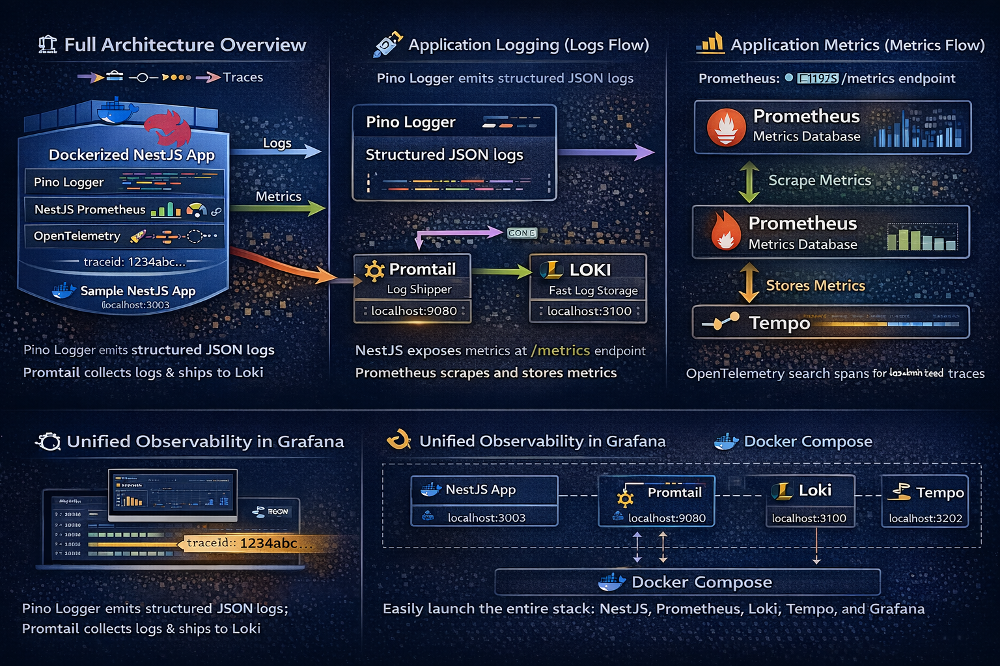
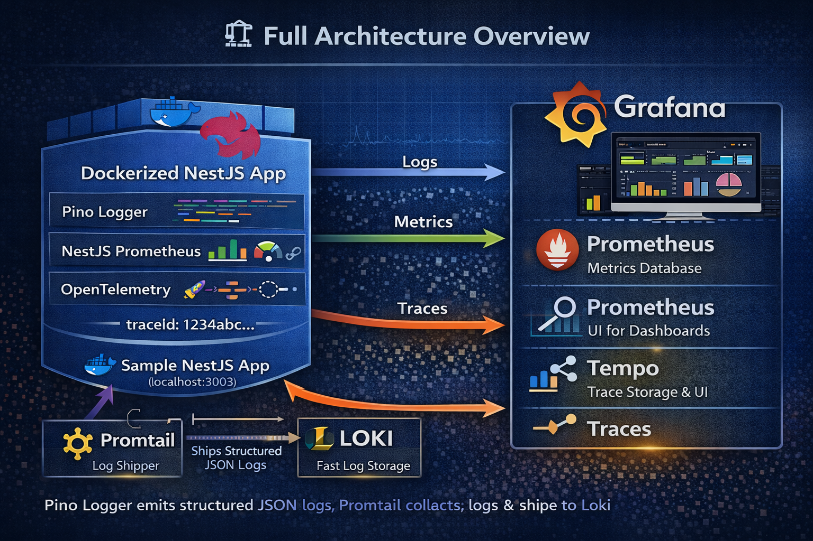
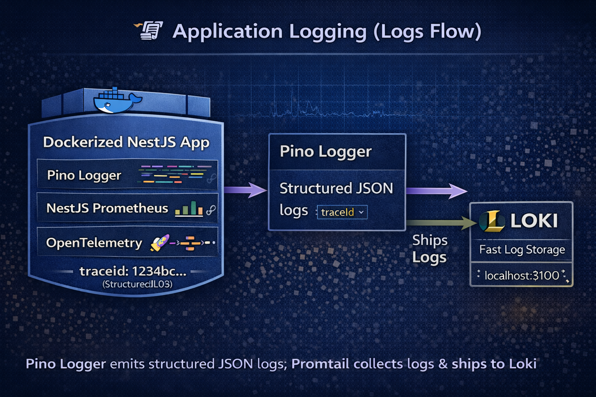
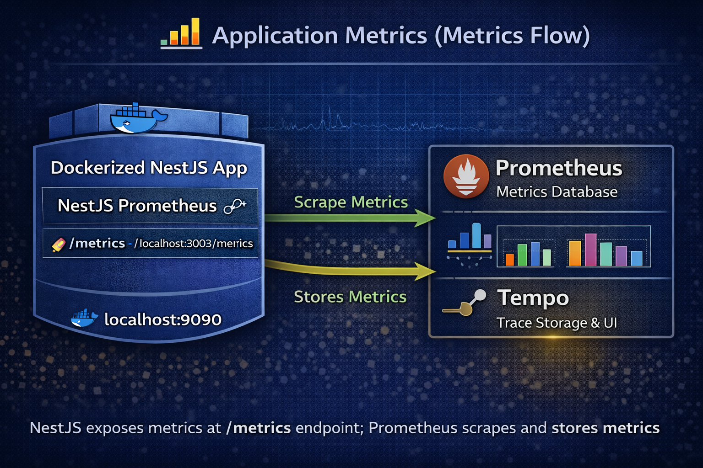
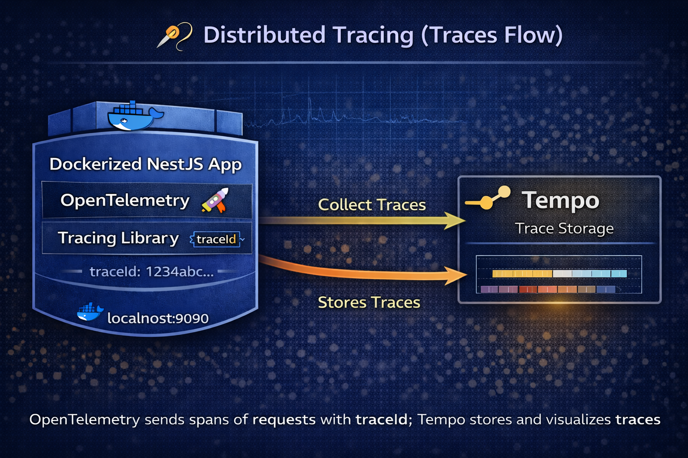
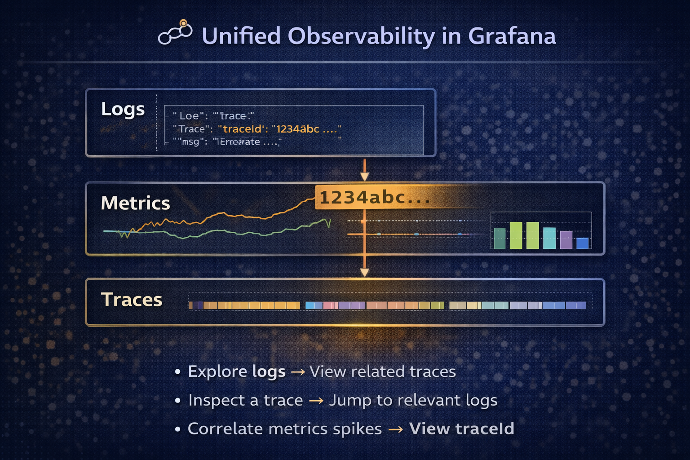
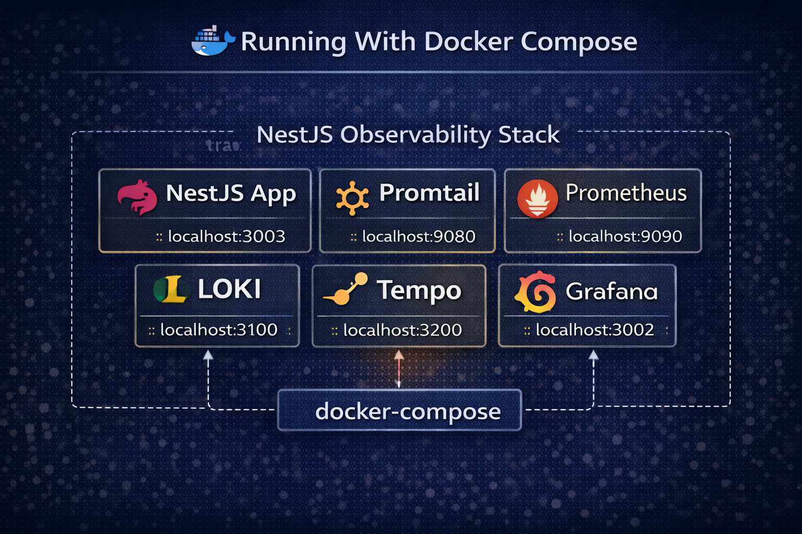

# Implementing Microservices in NodeJs/NestJS

🚀 Production-Grade Microservices in NodeJS/NestJS

✅ NodeJS/NestJS Microservices 

✅ Retry + Circuit Breaker policies 

✅ Strong Idempotency guarantees 

✅ Full Observability (Metrics, Logs, Traces)

✅ Battle-tested locally before cloud deployment

## Open Source Monitoring Stack

End-to-end **logs, metrics, and traces** observability for a **Dockerized NestJS application** using the **Grafana LGTM stack** (Loki, Grafana, Tempo, Prometheus) with **OpenTelemetry**.



---

## 🚀 What This Project Demonstrates

This repository shows how to build **true observability (not just monitoring)** by correlating:

- 📜 **Logs** (Pino → Loki)
- 📊 **Metrics** (Prometheus)
- 🧵 **Traces** (OpenTelemetry → Tempo)

All signals are linked using a shared **`traceId`** and visualized in **Grafana**.

---

🧱 What’s Included

The project includes complete configurations + Docker setup for:

- **Prometheus** — metrics collection & scraping

- **Grafana** — dashboards and visualization

- **Loki** — log aggregation

- **Promtail** — log shipping to Loki

- **Tempo** — distributed tracing storage

- **NestJS App** — sample backend instrumented for logs, metrics, and traces

All components are orchestrated via a single docker-compose.yml to spin up the full stack locally.

---

📁 Repository Structure

Here’s what the core folders represent:

```

├── grafana/                 # Grafana provisioning (datasources)
├── loki/                    # Loki config
├── prometheus/              # Prometheus config
├── promtail/                # Promtail config
├── tempo/                   # Tempo tracing config
├── my-nestjs-app/           # Sample NestJS app with observability
├── docker-compose.yml       # Compose config to launch everything
└── README.md                # Project overview + quick start

````

---

## 🧱 Architecture Overview



### High-Level Flow

1. **NestJS Application**
   - Structured logging with **Pino**
   - Metrics via **nestjs-prometheus**
   - Distributed tracing via **OpenTelemetry**
2. **Promtail**
   - Collects container logs
   - Pushes logs to **Loki**
3. **Prometheus**
   - Scrapes `/metrics` endpoint
4. **Tempo**
   - Stores and indexes traces
5. **Grafana**
   - Single pane of glass for logs, metrics, and traces

---

## 🔍 Observability Pillars

    ### ✨ Features

    - ✅ Structured JSON logging with Pino

    - ✅ Prometheus metrics via NestJS

    - ✅ Distributed tracing using OpenTelemetry

    - ✅ Log aggregation with Loki + Promtail

    - ✅ Trace storage with Tempo

    - ✅ Grafana as a single observability UI

    - ✅ Fully Docker Compose based

    - ✅ Log ↔ Metric ↔ Trace correlation using traceId
 

### 📜 Logs (Loki)



- JSON logs via **Pino**
- Each log line includes:
  - `traceId`
  - `spanId`
  - `service.name`
- Logs shipped using **Promtail**

---

### 📊 Metrics (Prometheus)



- Application metrics exposed at `/metrics`
- Includes:
  - HTTP request duration
  - Request count
  - Error rates
  - Process & Node.js metrics

---

### 🧵 Traces (Tempo + OpenTelemetry)



- Automatic + manual spans
- Context propagation across async boundaries
- Trace export using **OTLP**
- Stored and queried in **Tempo**

---

## 🔗 Correlation with traceId



From **Grafana**, you can:

- Jump from a **log line → trace**
- Jump from a **trace → related logs**
- Correlate **metrics spikes → exact traces**

This answers:
> *What happened? Where? And why?*

---

## 📁 Folder Structure

```

monitoring/
├── prometheus/             # Prometheus metrics config
│   └── prometheus.yml
├── grafana/                # Grafana provisioning for datasources
│   └── provisioning/
│       └── datasources/
│           └── datasource.yml
├── loki/                   # Loki log aggregation config
│   └── config.yaml
├── tempo/                  # Tempo tracing config
│   └── tempo-config.yaml
├── promtail/               # Promtail log shipper config
│   └── promtail-config.yaml
└── my-nestjs-app/
│   ├── src/
│   ├── Dockerfile
│   └── package.json
└── docker-compose.yml      # Docker Compose setup

````

## 🐳 Dockerized Setup



All components run via **Docker Compose**:

- `my-nestjs-app`
- `prometheus`
- `loki`
- `promtail`
- `tempo`
- `grafana`

---


## ▶️ Getting Started

### 1️⃣ Clone the Repository

```bash
git clone https://github.com/maheshvnit/ncl_microservices_in_nestjs
cd ncl_microservices_in_nestjs
```

### 2️⃣ Start first the Observability Stack

```bash
docker compose up -d
```

### 3️⃣ Access Services (🌐 Service Endpoints)

| Service      | URL                          |
|-------------|------------------------------|
| Grafana     | http://localhost:3002        |
| NestJS API  | http://localhost:3003        |
| Metrics     | http://localhost:3003/metrics|
| Prometheus  | http://localhost:9090        |
| Loki        | http://localhost:3100        |
| Tempo       | http://localhost:3200        |

(Grafana Credentials)
    
- Username: **admin**
- Password: **admin**

---

### 4 Next start the NodeJS/NestJS Microservices Stack in other tab/terminal

```bash
cd nest-ms-platform
docker compose up --build
```

### 5 Access Services (🌐 Service Endpoints)

| Service             | URL                            |
|---------------------|--------------------------------|
| API Gateway         | http://localhost:4040          |
| Users endpoint      | http://localhost:4040/users    |
| Orders endpoint     | http://localhost:4040/orders   |
| Payments endpoint   | http://localhost:4040/payments |


- API Gateway: http://localhost:4040

- Users endpoint: http://localhost:4040/users

- Orders endpoint: http://localhost:4040/orders

- Payments endpoint: http://localhost:4040/payments


---

## 📈 Grafana Dashboards

- Users


- Orders


- Payments


---

## 🛠️ Tech Stack

- **NestJS**
- **Pino**
- **OpenTelemetry**
- **Prometheus**
- **Grafana**
- **Loki**
- **Tempo**
- **Docker & Docker Compose**

| Category      | Tool                    |
| ------------- | ----------------------- |
| Microservices | NestJS                  |
| Logging       | Pino                    |
| Metrics       | Prometheus              |
| Tracing       | OpenTelemetry           |
| Log Storage   | Loki                    |
| Trace Store   | Tempo                   |
| Visualization | Grafana                 |
| Runtime       | Docker + Docker Compose |


---

## 📌 Use Cases

- Microservices observability
- Debugging production incidents
- Performance tuning
- SRE / Platform engineering setups
- Learning LGTM stack

---

## 🤝 Contributing

PRs and improvements are welcome!
Feel free to open issues or suggest enhancements.

---

## ⭐ If this helped you

Give the repo a ⭐ and share it with your team!

---

## 📜 License

MIT License
