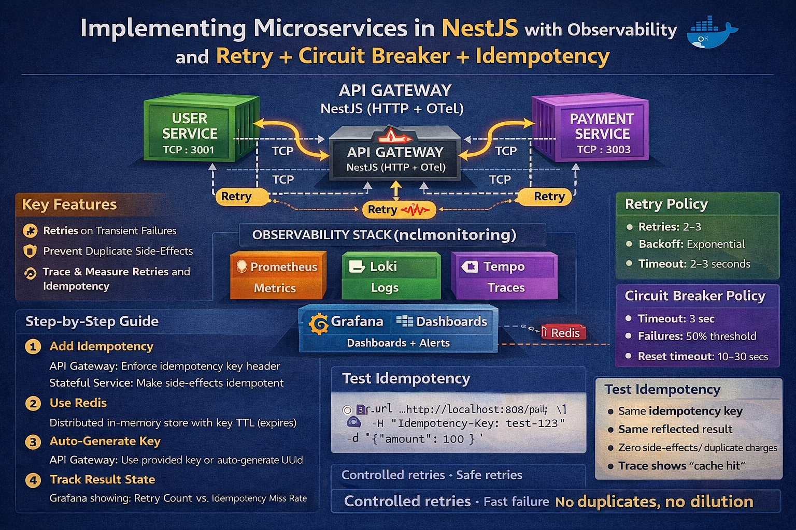
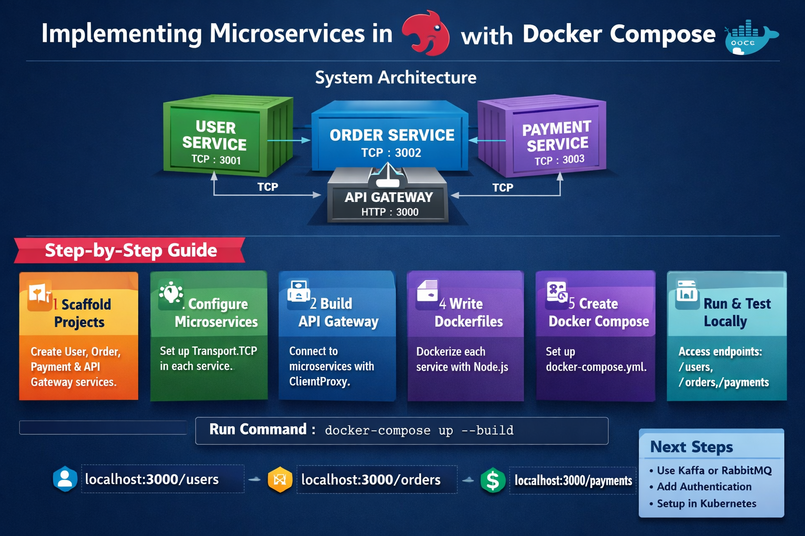
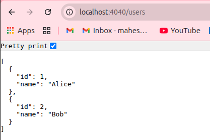
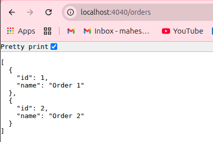
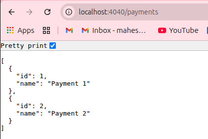
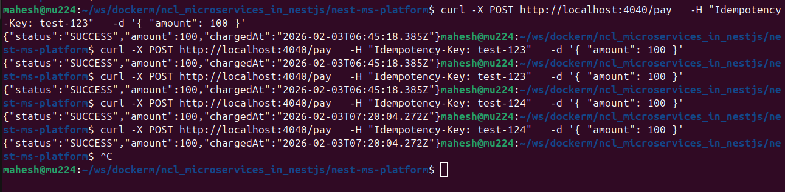
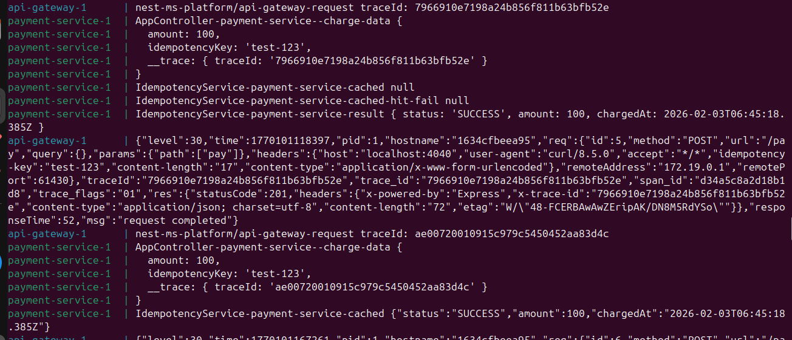
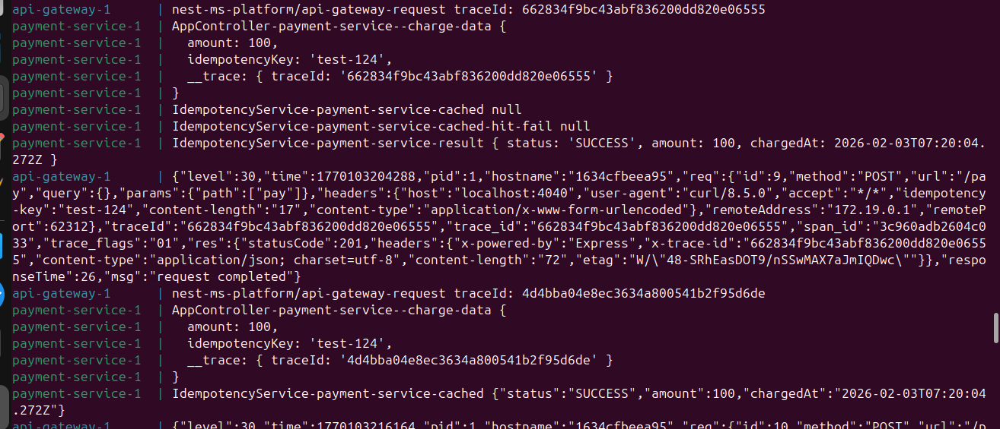

# Implementing Microservices in NodeJS/NestJS

🚀 Production-Grade Microservices in NodeJS/NestJS

✅ NodeJS/NestJS Microservices 

✅ Retry + Circuit Breaker policies 

✅ Strong Idempotency guarantees 

✅ Full Observability (Metrics, Logs, Traces)

✅ Battle-tested locally before cloud deployment

---

### 🧠 Understanding the Core Concepts

Before coding, it’s important to grasp what **NestJS** uses for microservices:

**Transport layers** — how services communicate (e.g., TCP, RabbitMQ/Kafka, Redis, NATS, gRPC). Each has its own driver but the NestJS interface stays consistent. 

**Message patterns** — microservices route messages based on patterns, not HTTP routes. NestJS uses @MessagePattern() for request/response and @EventPattern() for event-based messages.

   - **Request-Response**: Like a remote function call: send a command & wait for reply.

   - **Event-based**: Fire an event; subscribers react; no direct response expected.

---



## Open Source Monitoring Stack

End-to-end **logs, metrics, and traces** observability for a **Dockerized NestJS application** using the **Grafana LGTM stack** (Loki, Grafana, Tempo, Prometheus) with **OpenTelemetry**.

---

## 📌 What This Project Demonstrates

This project demonstrates how to design, build, and run **production-grade microservices** using **NodeJS and NestJS**, with a strong focus on reliability, correctness, and operational excellence.

It covers the **real-world patterns required in distributed systems**, not just basic service communication.

## 🚀 Core Focus Areas

- NodeJS / NestJS Microservices

   - TCP-based and HTTP-based service communication

   - Clean modular architecture with shared libraries

   - Explicit service boundaries and contracts

- Retry + Circuit Breaker Policies

   - Resilient client patterns to handle transient failures

   - Controlled retries with backoff

   - Circuit breakers to prevent cascading failures

- Strong Idempotency Guarantees

   - Safe handling of duplicate requests

   - Protection against double processing (especially for payments)

   - Deterministic request handling across retries

- Full Observability (Metrics, Logs, Traces)

   - Structured JSON logging with trace correlation

   - Prometheus metrics per service

   - Distributed tracing across microservices

   - Unified visibility via Grafana stack

- Battle-Tested Locally Before Cloud Deployment

   - Docker-based local orchestration

   - Failure simulation and resilience testing

   - Designed to behave the same locally and in cloud environments


## 🎯 Goal of This Repository

The goal is to serve as a reference implementation for building robust, observable, and resilient NestJS microservices that are ready for real production workloads — not just demos or tutorials.


---

## 🚀 What This Project Demonstrates

This repository shows how to build **true observability (not just monitoring)** by correlating:

- 📜 **Logs** (Pino → Loki)
- 📊 **Metrics** (Prometheus)
- 🧵 **Traces** (OpenTelemetry → Tempo)

All signals are linked using a shared **`traceId`** and visualized in **Grafana**.

---

🧱 What’s Included

The project includes complete configurations + Docker setup for:

- **Prometheus** — metrics collection & scraping

- **Grafana** — dashboards and visualization

- **Loki** — log aggregation

- **Promtail** — log shipping to Loki

- **Tempo** — distributed tracing storage

- **NestJS Microservices** — sample Microservices instrumented with TCP and logs, metrics, and traces

All components are orchestrated via a single docker-compose.yml to spin up the full stack locally.

---

📁 Repository Structure

Here’s what the core folders represent:

```
├── nest-ms-platform/        # Sample NestJS Microservices with observability
├── grafana/                 # Grafana provisioning (datasources)
├── loki/                    # Loki config
├── prometheus/              # Prometheus config
├── promtail/                # Promtail config
├── tempo/                   # Tempo tracing config
├── my-nestjs-app/           # Sample NestJS app with observability
├── docker-compose.yml       # Compose config to launch everything
└── README.md                # Project overview + quick start

````

---

## 🧱 Goal & Architecture Overview

We will build:

   -  **3 Microservices** (User, Order, Payment)

   -  **1 API Gateway** (HTTP entry point)

   -  **Local Docker Compose stack** to orchestrate containers

Each microservice will handle its own logic and communicate with others via **NestJS microservice Transport (TCP)**. 

This guide focuses on **TCP** for simplicity — messaging brokers like Kafka/RabbitMQ are optional next steps



### High-Level Flow

0. **NestJS Microservices**
   - Microservices communication with **TCP**
   - Structured logging with **Pino**
   - Metrics via **nestjs-prometheus**
   - Distributed tracing via **OpenTelemetry**
1. **NestJS Application**
   - Structured logging with **Pino**
   - Metrics via **nestjs-prometheus**
   - Distributed tracing via **OpenTelemetry**
2. **Promtail**
   - Collects container logs
   - Pushes logs to **Loki**
3. **Prometheus**
   - Scrapes `/metrics` endpoint
4. **Tempo**
   - Stores and indexes traces
5. **Grafana**
   - Single pane of glass for logs, metrics, and traces

---

## 🔍 Observability Pillars

    ### ✨ Features

    - ✅ Structured JSON logging with Pino

    - ✅ Prometheus metrics via NestJS

    - ✅ Distributed tracing using OpenTelemetry

    - ✅ Log aggregation with Loki + Promtail

    - ✅ Trace storage with Tempo

    - ✅ Grafana as a single observability UI

    - ✅ Fully Docker Compose based

    - ✅ Log ↔ Metric ↔ Trace correlation using traceId
 

---

---


## 📁 Folder Structure

```

monitoring/
├── prometheus/             # Prometheus metrics config
│   └── prometheus.yml
├── grafana/                # Grafana provisioning for datasources
│   └── provisioning/
│       └── datasources/
│           └── datasource.yml
├── loki/                   # Loki log aggregation config
│   └── config.yaml
├── tempo/                  # Tempo tracing config
│   └── tempo-config.yaml
├── promtail/               # Promtail log shipper config
│   └── promtail-config.yaml
└── my-nestjs-app/
│   ├── src/
│   ├── Dockerfile
│   └── package.json
└── docker-compose.yml      # Docker Compose setup

````

```

nest-ms-platform/
├── api-gateway/            # HTTP based API root endpoint for all microservices
│   ├── src/
│   ├── Dockerfile
│   └── package.json
└── user-service/           # TCP based user-service microservice
│   ├── src/
│   ├── Dockerfile
│   └── package.json
└── order-service/          # TCP based order-service microservice
│   ├── src/
│   ├── Dockerfile
│   └── package.json
└── payment-service/        # TCP based payment-service microservice
│   ├── src/
│   ├── Dockerfile
│   └── package.json
└── docker-compose.yml      # Microservices Docker Compose setup with redis

````

## 🐳 Dockerized Setup


All components run via **Docker Compose**:

- `api-gateway`
- `user-service`
- `order-service`
- `payment-service`
- `redis`

---

## What We Are Building (Clear Target)

# Final System (Local)

```
┌────────────┐
│  Grafana   │◄──────────────┐
└────────────┘               │
┌────────────┐   ┌───────────┴───────────┐
│ Prometheus │   │   Observability Stack │
└────────────┘   │  (nclmonitoring)      │
┌────────────┐   │                       │
│   Loki     │   │  Metrics / Logs /     │
└────────────┘   │  Traces / Alerts      │
┌────────────┐   └───────────▲───────────┘
│   Tempo    │               │
└────────────┘               │
                             
┌──────────────────────────────────────────┐
│               API Gateway                │
│        NestJS (HTTP + OTel)              │
└──────────────▲───────────────▲──────────┘
               │ TCP            │ TCP
┌──────────────┴──────┐ ┌──────┴─────────┐
│   User Service      │ │  Order Service │
│ NestJS Microservice │ │ NestJS MS      │
└──────────────▲──────┘ └──────▲─────────┘
               │ TCP            │ TCP
        ┌──────┴─────────┐
        │ Payment Service │
        │ NestJS MS       │
        └────────────────┘

````

---


# 🛠 Prerequisites


## A. Prerequisites

```
# Node.js >= 20
node -v
npm -v

# Docker >= 24
docker --version

# Docker Compose v2
docker compose version
````

## B. Prerequisites
Install the following: NestJs CLI

```
# Nest CLI
npm install -g @nestjs/cli
````

---

## ▶️ Getting Started

### 1️⃣ Clone the Repository

```bash
git clone https://github.com/maheshvnit/ncl_microservices_in_nestjs
cd ncl_microservices_in_nestjs
```

### 2️⃣ Start first the Observability Stack

```bash
docker compose up -d
```

### 3️⃣ Access Services (🌐 Service Endpoints)

| Service      | URL                          |
|-------------|------------------------------|
| Grafana     | http://localhost:3002        |
| NestJS API  | http://localhost:3003        |
| Metrics     | http://localhost:3003/metrics|
| Prometheus  | http://localhost:9090        |
| Loki        | http://localhost:3100        |
| Tempo       | http://localhost:3200        |

(Grafana Credentials)
    
- Username: **admin**
- Password: **admin**

---

### 4 Next start the NodeJS/NestJS Microservices Stack in other tab/terminal

```bash
cd nest-ms-platform
docker compose up --build
```

### 5 Access Services (🌐 Service Endpoints)

| Service             | URL                            |
|---------------------|--------------------------------|
| API Gateway         | http://localhost:4040          |
| Users endpoint      | http://localhost:4040/users    |
| Orders endpoint     | http://localhost:4040/orders   |
| Payments endpoint   | http://localhost:4040/payments |


- API Gateway: http://localhost:4040

- Users endpoint: http://localhost:4040/users

- Orders endpoint: http://localhost:4040/orders

- Payments endpoint: http://localhost:4040/payments


---

## 📈 Now you will see user data coming from the microservice, like


- Users



- Orders



- Payments



- Charge payment via Post API from cli


```
curl -X POST http://localhost:4040/pay   -H "Idempotency-Key: test-124"   -d '{ "amount": 100 }'
````





---

## 🛠️ Tech Stack

- **NestJS**
- **Pino**
- **OpenTelemetry**
- **Prometheus**
- **Grafana**
- **Loki**
- **Tempo**
- **Docker & Docker Compose**

| Category      | Tool                    |
| ------------- | ----------------------- |
| Microservices | NestJS                  |
| Logging       | Pino                    |
| Metrics       | Prometheus              |
| Tracing       | OpenTelemetry           |
| Log Storage   | Loki                    |
| Trace Store   | Tempo                   |
| Visualization | Grafana                 |
| Runtime       | Docker + Docker Compose |


---

## 📌 Use Cases

- Microservices observability
- Debugging production incidents
- Performance tuning
- SRE / Platform engineering setups
- Learning LGTM stack

---

## 🤝 Contributing

PRs and improvements are welcome!
Feel free to open issues or suggest enhancements.

---

## ⭐ If this helped you

Give the repo a ⭐ and share it with your team!

---

## 📜 License

MIT License
